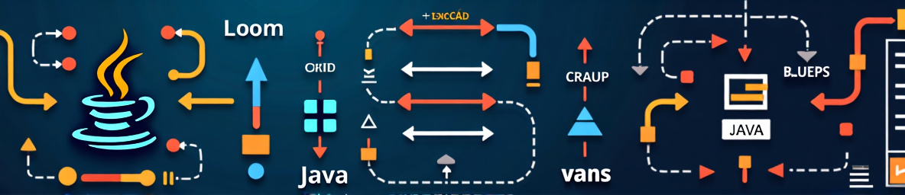

# Programación

## 1º CFGS DAM (2024-2025)

[README_ES.md (contenido en Español)](README_ES.md) :es:

# [IES Eduardo Primo Marqués](http://www.ieseduardoprimo.es) (Carlet)

# Fuentes de información

- [Wikipedia](https://es.wikipedia.org)
- [Programación (Grado Superior) - Juan Carlos Moreno Pérez (Ed. Ra-ma)](https://www.ra-ma.es/libro/programacion-grado-superior_48302/)
- Apuntes IES Henri Matisse (Javi García Jimenez?)
- Apuntes AulaCampus
- [Apuntes José Luis Comesaña](https://www.sitiolibre.com/)
- [Apuntes IOC Programació bàsica (Joan Arnedo Moreno)](https://ioc.xtec.cat/materials/FP/Recursos/fp_asx_m03_/web/fp_asx_m03_htmlindex/index.html)
- [Apuntes IOC Programació Orientada a Objectes (Joan Arnedo Moreno)](https://ioc.xtec.cat/materials/FP/Recursos/fp_dam_m03_/web/fp_dam_m03_htmlindex/index.html)
- [Apuntes Lionel](https://github.com/lionel-ict/ApuntesProgramacion)
- https://www.cs.usfca.edu/~galles/visualization/Algorithms.html
- https://docs.oracle.com/javase/tutorial/java/javaOO/lambdaexpressions.html
- https://arturoblasco.github.io/pr
- https://www.objectdb.com/java/jpa

# Etiquetas:

\#fpinfor #PRG #programacion #CFGS #DAW #DAM #INFORMATICA #desarrollo #codificacion

# Converting from `MD` (MarkDown) to `PDF`

More info in [fromMD2PDF](https://github.com/martinezpenya/fromMD2PDF) repository.

# License

[PRG 24-25 ](https://github.com/martinezpenya/PRG-CFGS-2425) © 2021   by  [David Martinez](http://www.martinezpenya.es) is licensed under [Attribution-NonCommercial-ShareAlike 4.0 International](http://creativecommons.org/licenses/by-nc-sa/4.0/?ref=chooser-v1)