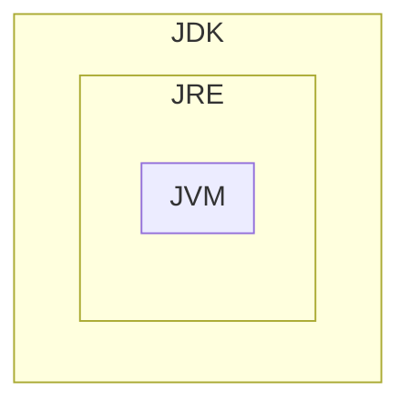

---
title: Taller 02: Instalación y uso de entornos de desarrollo
language: ES
author: David Martínez Peña [www.martinezpenya.es]
subject: Programación
keywords: [PRG, 2024, Programacion, Java]
IES: IES Eduardo Primo Marqués (Carlet) [www.ieseduardoprimo.es]
header: ${title} - ${subject} (ver. ${today}) 
footer:${currentFileName}.pdf - ${author} - ${IES} - ${pageNo}/${pageCount}
typora-root-url:${filename}/../
typora-copy-images-to:${filename}/../assets
---
[toc]
# Java

Cada software y cada entorno de desarrollo tiene unas características y funcionalidades específicas. Esto también se verá reflejado en la instalación y configuración del software. Dependiendo de la plataforma, entorno o sistema operativo en el que se vaya a instalar el software, se utilizará un paquete de instalación u otro, y habrá que tener en cuenta unas opciones u otras en su configuración.
A continuación se muestra cómo instalar una herramienta de desarrollo de software integrada, como Eclipse. Pero también podrás observar los procedimientos para instalar otras herramientas necesarias o recomendadas para trabajar con el lenguaje de programación JAVA, como Tomcat o la Máquina Virtual de Java.
Debes tener en cuenta los siguientes conceptos:

- La JVM (Java Virtual Machine, máquina virtual de Java) es la encargada de interpretar el bytecode y generar el código máquina del ordenador (o dispositivo) en el que se ejecuta la aplicación. Esto quiere decir que necesitamos una JVM distinta para cada entorno.
- JRE (Java Runtime Environment) es un conjunto de utilidades Java que incluye la JVM, las bibliotecas y el conjunto de software necesario para ejecutar aplicaciones cliente Java, así como el conector para que los navegadores de Internet ejecuten applets.
- JDK (Java Development Kit) es el conjunto de herramientas para desarrolladores; contiene, entre otras cosas, el JRE y el conjunto de herramientas necesarias para compilar el código, empaquetarlo, generar documentación...




El proceso de instalación consta de los siguientes pasos:
1. Descargue, instale y configure el JDK.
2. Descargue e instale un servidor web o de aplicaciones.
3. Descargue, instale y configure el IDE (Netbeans o Eclipse).
4. Configurar JDK con IDE.
5. Configure el servidor web o de aplicaciones con el IDE instalado.
6. Si es necesario, instalación de conectores.
7. Si es necesario, instale un nuevo software.


## Descargue e instale el JDK

Podemos diferenciar entre:

- Java SE (Java Standard Edition): es la versión estándar de la plataforma, siendo esta plataforma la base para todos los entornos de desarrollo Java ya sea de aplicaciones cliente, de escritorio o web.

- Java EE (Java Enterprise Edition): esta es la versión más grande de Java y generalmente se utiliza para crear grandes aplicaciones cliente/servidor y para el desarrollo de servicios web.

En este curso se utilizarán las funcionalidades de Java SE.
El archivo es diferente según el sistema operativo donde se tenga que instalar. Así:

- Para los sistemas operativos Windows y Mac OS hay un archivo instalable.
- Para los sistemas operativos GNU/Linux que admiten paquetes .rpm o .deb, también están disponibles paquetes de este tipo.
- Para el resto de sistemas operativos GNU/Linux existe un archivo comprimido (terminado en .tar.gz).

En los dos primeros casos, simplemente hay que seguir el procedimiento de instalación habitual del sistema operativo con el que estamos trabajando.
En este último caso, sin embargo, hay que descomprimir el archivo y copiarlo en la carpeta donde se desea instalar. Normalmente, todos los usuarios tendrán permisos de lectura y ejecución en esta carpeta.

> ### A partir de la versión 11 de JDK, Oracle distribuye el software con una licencia significativamente más restrictiva que las versiones anteriores. En particular, solo se puede utilizar para "desarrollar, probar, crear prototipos y demostrar sus aplicaciones". Cualquier uso "para fines comerciales, de producción o empresariales internos" distinto del mencionado anteriormente queda explícitamente excluido.
>
> Si lo necesitas para alguno de estos usos no permitidos en la nueva licencia, además de las versiones anteriores del JDK, existen versiones de referencia de estas versiones licenciadas "GNU General Public License version 2, with the Classpath Exception", que permiten la mayoría de los usos habituales. Estas versiones están enlazadas a la misma página de descarga y también a la dirección jdk.java.net.

Una alternativa es utilizar https://adoptium.net/ antes conocido como adoptOpenJDK, que ahora se ha integrado en la fundación Eclipse. Desde allí podemos descargar los binarios de la versión openJDK para nuestra plataforma sin restricciones. [Noticia completa] (https://es.wikipedia.org/wiki/OpenJDK).


> #### En GNU/Linux podemos utilizar los comandos:

>
> - `sudo apt install default-jdk` para instalar el jdk predeterminado.

> - `java --version` para ver las versiones disponibles en nuestro sistema.

> - `sudo update-alternatives --config java` para elegir cuál de las versiones instaladas queremos usar por defecto o incluso ver la ruta de las diferentes versiones que tenemos instaladas.

##Configurar las variables de entorno "JAVA_HOME" y "PATH"

Una vez descargado e instalado el JDK, debes configurar algunas variables de entorno:

- La variable `JAVA_HOME`: indica la carpeta donde se ha instalado el JDK. No es obligatorio definirla, pero es muy cómodo hacerlo, ya que muchos programas buscan en ella la ubicación del JDK. Además, resulta muy fácil definir las dos variables siguientes.

- La variable `PATH`. Debe apuntar al directorio que contiene el ejecutable de la máquina virtual. Suele ser la subcarpeta `bin` del directorio donde hemos instalado el JDK.

**Variable CLASSPATH**
Otra variable que tiene en cuenta el JDK es la variable `CLASSPATH`, que apunta a las carpetas donde se encuentran las librerías de la aplicación que se quiere ejecutar con el comando java. Es preferible, no obstante, indicar la ubicación de estas carpetas con la opción `-cp` del mismo comando java, ya que cada aplicación puede tener diferentes librerías y las variables de entorno afectan a todo el sistema.
Establecer la variable `PATH` es esencial para que el sistema operativo encuentre los comandos JDK y pueda ejecutarlos.

# Eclipse

Eclipse es una aplicación de código abierto desarrollada actualmente por Eclipse Foundation, una organización independiente, sin fines de lucro, que fomenta una comunidad de código abierto y el uso de un conjunto de productos, servicios, capacidades y complementos para la divulgación del uso de código abierto en el desarrollo de aplicaciones informáticas. Eclipse fue desarrollado originalmente por IBM como sucesor de VisualAge.
Como Eclipse está desarrollado en Java, es necesario, para su ejecución, tener un JRE (Java Runtime Environment) previamente instalado en el sistema. Para saber si tienes este JRE instalado, puedes hacer el test en la web oficial de Java, en la sección ¿Tengo Java?
Si vamos a desarrollar con Java, como es nuestro caso, deberemos tener instalado el JDK (recordemos que es un superconjunto del JRE).

## Instalación

Las versiones actuales del entorno Eclipse se instalan con un instalador. Este, básicamente, se encarga de descomprimir, solucionar algunas dependencias y crear los accesos directos.
Este instalador se puede obtener descargándolo directamente desde la página oficial del Proyecto Eclipse [www.eclipse.org](www.eclipse.org). Podrás encontrar las versiones para los diferentes sistemas operativos e instrucciones para su uso. No son nada complejas.
En el caso de GNU/Linux y MAC OS, el archivo es un archivo comprimido, por lo que hay que descomprimirlo y luego ejecutar el instalador. Se trata del archivo *eclipse-inst*, dentro de la carpeta eclipse, que es una subcarpeta del resultado de descomprimir el archivo anterior.
Si sólo el usuario actual va a utilizar el IDE, la instalación se puede realizar sin utilizar privilegios de administrador o root y seleccionando para la instalación una carpeta perteneciente a este usuario. Si se desea compartir la instalación entre distintos usuarios, se debe indicar al instalador una carpeta sobre la que todos estos usuarios tengan permisos de lectura y ejecución.

Al iniciar el instalador veremos una pantalla similar a esta:


El instalador nos preguntará qué versión queremos instalar. La versión que utilizaremos es “Eclipse IDE for Java EE Developers”.


Luego nos pedirá la versión de JDK/JRE que vamos a utilizar (en la captura aparece con letras blancas). También nos pide la carpeta donde la instalaremos. Y dos check boxes para indicar si queremos que nos cree el acceso directo al menú de aplicaciones ya en el escritorio.


Para seleccionar la carpeta correcta hay que tener en cuenta qué usuarios van a utilizar el entorno. Todos ellos deben tener permisos de lectura y ejecución sobre la carpeta en cuestión. Una vez introducida la carpeta podemos pulsar el botón INSTALAR para iniciar la instalación.

También se nos pedirá que aceptemos las licencias del software a instalar, como muestra la captura de pantalla:


Durante la instalación veremos una pantalla de progreso como la que se muestra a continuación:


Una vez finalizada la instalación, se nos muestra una pantalla que nos invita a ejecutar directamente el entorno.


Esta primera vez podremos ejecutar el entorno Eclipse pulsando el botón LAUNCH. El resto de las veces será necesario invocarlo desde los accesos directos o lanzadores, si se han creado o, en caso contrario, invocando directamente el ejecutable. Este se llama eclipse y lo encontrarás en una subcarpeta de la carpeta de instalación también llamada eclipse. La ruta exacta puede variar de una versión a otra.
Si en el futuro es necesario desinstalarlo, sólo se debe borrar la carpeta donde ha sido instalado ya que la instalación de Eclipse no aparece en el repositorio de GNU/Linux ni en el panel de control en Windows.
Cuando ejecutamos el entorno nos aparecerá una pantalla como la siguiente:


Inmediatamente se nos preguntará en qué carpeta se ubicará el workspace. Podemos pedirle que lo recuerde para el resto de ejecuciones activando la opción “*Usar esto como predeterminado y no volver a preguntar*”.


La primera vez que lo ejecutemos se mostrará la pestaña de bienvenida. Podemos pedirle que no nos la muestre más desactivando la opción “Mostrar siempre la bienvenida al iniciar”.


Una vez cerrada esta pestaña, el entorno de trabajo será similar a esto:


> ### Por defecto Eclipse nos ofrece la descarga del instalador más ligero que descargará de Internet los paquetes necesarios para completar la instalación según nuestras elecciones. Si esta instalación nos da problemas, podemos descargar la versión "package" en la que previamente deberemos elegir el paquete de instalación que queramos, ocupará bastante más, pero descargará todos los paquetes necesarios. Después solo tendremos que descomprimir el archivo descargado en una carpeta de nuestra elección y ya tendremos eclipse instalado. Tendremos que crear nuestro propio menú de inicio e iconos del escritorio (podéis seguir esta [guía] (https://www.donovanbrown.com/post/Añadir-Eclipse-al-Launcher-en-Ubuntu-1604) cambiando la ruta donde habéis descomprimido vuestra versión de eclipse).

## Configuración

**Versión Java**

Por defecto Eclipse intenta utilizar las nuevas características del JDK 16, pero en nuestro caso por ejemplo tenemos la versión 11. Podemos personalizar estas opciones en el apartado `Ventana/Preferencias/Java/Compilador` y elegir en el campo `Nivel de conformidad del compilador` la versión correcta, en nuestro caso la 11.

Además, si lo necesitamos, podemos configurar los JDKs que están disponibles, añadirlos o eliminarlos desde la opción `Ventana/Preferencias/Java/JRE instalados`.

**Perspectiva**

Eclipse llama a la distribución de los paneles en la ventana Perspectiva, hay unos cuantos predefinidos y podemos configurar los nuestros, a nuestro gusto en la sección `Ventana/Perspectiva`.

**Apariencia**

Eclipse nos permite personalizar cualquier aspecto de la apariencia de nuestro entorno, cambiar tanto el tema del IDE como el tamaño de fuente y los colores para el coloreado del código fuente. Todas estas opciones están disponibles en `Ventana/Apariencia`.

## Módulos

Las opciones y funcionalidades de Eclipse se pueden ampliar añadiendo módulos desde su "store" de plugins. En `Help/Eclipse Marketplace...` podemos por ejemplo buscar por texto, o buscar en la pestaña de populares. Eso nos mostrará todos los complementos que contengan la palabra buscada, o los complementos más descargados del marketplace. Podemos instalar, por ejemplo, `SonarLint 6.0` que nos ayuda a mantener nuestro código limpio de errores comunes, para ello simplemente tenemos que pulsar el botón `INSTALAR` que aparece a su lado en el listado, aceptar la licencia de uso y automáticamente nos pedirá que reiniciemos el `IDE`.

## Uso básico ("¡Hola mundo!")

Eclipse proporciona información sobre su uso en la sección de `Ayuda`, y podemos aprender a crear nuestro primer proyecto en Java (el típico “¡Hola Mundo!”). Para ello debemos abrir la ventana de `Bienvenido`, que es la que nos aparece cuando abrimos eclipse por primera vez, o bien podemos abrirla desde `Ayuda/Bienvenido`, desde esta ventana podemos elegir la sección de `Tutoriales`, y dentro de la sección de Desarrollo Java, elegir el primer ítem “Crear una aplicación Hola Mundo”, y el propio Eclipse nos irá guiando paso a paso para crear y ejecutar nuestro primer proyecto Java en Eclipse.

## Actualización y mantenimiento

En la misma sección `Ayuda` Eclipse nos proporciona las opciones para actualizar el propio Eclipse o los complementos que tengamos instalados `Ayuda/Buscar actualizaciones`.

Podemos personalizar el comportamiento respecto a las actualizaciones en la sección `Ventana/Preferencias/Instalar/Actualizar/Actualizaciones automáticas`.

# Netbeans

NetBeans es una herramienta de entorno de desarrollo integrado (IDE) muy potente que se utiliza principalmente para el desarrollo en Java y C/C++. Permite desarrollar fácilmente aplicaciones web, de escritorio y móviles desde su marco modular. Puede agregar soporte para otros lenguajes de programación como PHP, HTML, JavaScript, C, C++, Ajax, JSP, Ruby on Rails, etc. mediante extensiones.

Se ha lanzado NetBeans IDE 12 con soporte para Java JDK 11. También incluye las siguientes características:

- Soporte para PHP 7.0 a 7.3, PHPStan y Twig.
- Incluir módulos en el clúster "webcommon". Es decir, todas las funciones de JavaScript en Apache NetBeans GitHub son parte de Apache NetBeans 10.
- Los módulos de clúster "groovy" están incluidos en Apache NetBeans 10.
- OpenJDK puede detectar automáticamente JTReg desde la configuración de OpenJDK y registrar el JDK expandido como una plataforma Java.
- Soporte para JUnit 5.3.1

## Instalación

Podemos instalar NetBeans de tres maneras:

### Instalar desde binarios

**Paso 1: Descargue el archivo NetBeans**

Descargue el archivo binario de NetBeans 12 `netbeans-12.4-bin.zip`.

**Paso 2: Extraer el archivo**

Espere a que finalice la descarga y luego extráigala.

``` sh
$ unzip netbeans-12.4-bin.zip
```

Confirme el contenido del archivo de directorio creado:

``` bash
$ ls netbeans
apisupport    enterprise  groovy   javafx    netbeans.css  profiler
bin           ergonomics  harness  LICENSE   NOTICE        README.html
cpplite       etc         ide      licenses  php           webcommon
DEPENDENCIES  extide      java     nb        platform      websvccommon
```
**Step 3: Move the `netbeans` folder to `/opt`**

Ahora movamos la carpeta `netbeans/` a `/opt`

```sh
$ sudo mv netbeans/ /opt/
```
**Paso 4: Ruta de configuración**

El binario ejecutable de Netbeans se encuentra en `/opt/netbeans/bin/netbeans`. Necesitamos agregar su directorio principal a nuestro `$PATH` para poder iniciar el programa sin especificar la ruta absoluta al archivo binario.
Abra su archivo `~/.bashrc` o `~/.zshrc`.


```sh
$ nano ~/.bashrc
```
Añade la siguiente línea al final
```sh
export PATH = "$PATH:/opt/netbeans/bin/"
```
Obtenga el archivo para iniciar Netbeans sin reiniciar el shell.
```sh
$ source ~/.bashrc
```
**Paso 5: Crear el iniciador de escritorio NetBeans IDE** (opcional)

Cree un nuevo archivo en `/usr/share/applications/netbeans.desktop`.

``` sh
$ sudo nano /usr/share/applications/netbeans.desktop
```

Añade los siguientes datos.

```sh
[Desktop Entry]
Name=Netbeans IDE
Comment=Netbeans IDE
Type=Application
Encoding=UTF-8
Exec=/opt/netbeans/bin/netbeans
Icon=/opt/netbeans/nb/netbeans.png
Categories=GNOME;Application;Development;
Terminal=false
StartupNotify=true
```

Para desinstalar NetBeans debemos eliminar la carpeta `netbeans/` que está dentro de la carpeta /opt/, podemos utilizar el comando:

```bash
$ sudo rm /opt/netbeans -rf
```

**Paso 6: Configurar correctamente el JDK** (opcional)

En el fichero `/opt/netbeans/etc/netbeans.conf` debemos especificar correctamente la ruta de nuestro JDK en la variable `netbeans_jdkhome`. En GNU/Linux podemos saber los JDK disponibles con el comando `sudo update-alternatives --config java` que nos mostrará un resultado similar a este:

```bash
Hi ha 3 possibilitats per a l'alternativa java (que proveeix /usr/bin/java).

  Selecció    Camí                                           Prioritat  Estat
------------------------------------------------------------
* 0            /usr/lib/jvm/java-14-openjdk-amd64/bin/java      1411      mode automàtic
  1            /usr/lib/jvm/java-11-openjdk-amd64/bin/java      1111      mode manual
  2            /usr/lib/jvm/java-14-openjdk-amd64/bin/java      1411      mode manual
  3            /usr/lib/jvm/java-8-openjdk-amd64/jre/bin/java   1081      mode manual

Premeu retorn per a mantenir l'opció per defecte[*], o introduïu un número de selecció:
```

En la configuración de netbeans no es necesario especificar el final de la ruta `bin/java`


```bash
netbeans_jdkhome="/usr/lib/jvm/java-11-openjdk-amd64/"
```

### Instalar desde script

**Paso 1: Descargue el archivo NetBeans**

También puede instalar Netbeans 12.4 en GNU/Linux desde un script proporcionado para descargar `Apache-NetBeans-12.4-bin-linux-x64.sh`.

**Paso 2: Ejecutar el script**

Debes ejecutar el script de instalación

```sh
$  sudo sh ./Apache-NetBeans-12.4-bin-linux-x64.sh
```
> ### Si ejecuta el script como `root` (`sudo`) Netbeans estará disponible para todos los usuarios. Por el contrario, si ejecuta el usuario sin `sudo`, solo estará disponible para su usuario.

Aparecerá una barra de progreso como esta:


Ahora podemos elegir los componentes que queremos instalar con el IDE de Netbeans, lo dejaremos por defecto y pulsaremos el botón siguiente.


**Paso 3: Aceptar la licencia**

Luego debemos aceptar el acuerdo de licencia de uso marcando la casilla y presionando el botón siguiente.


**Paso 4: Elija la ruta de instalación y el JDK**

Ahora debemos elegir la ruta donde se instalará Netbeans 12.4. Y debemos elegir la ruta donde se encuentra el JDK (por defecto indica `/usr`, pero debemos especificar la ubicación como por ejemplo `/usr/lib/jvm/java-11-openjdk-amd64`).


**Paso 5: Actualizaciones automáticas**

En este punto se muestra un resumen de la instalación, y podemos elegir si queremos que NetBeans busque e instale actualizaciones desde Internet, y pulsar el botón instalar.


**Paso 6: Instalación**

Aparecerá una barra de progreso.


**Paso 7: Paso final**

Al terminar, aparecerá una pantalla con las acciones realizadas por el instalador y ya tendremos los launchers creados en el menú de aplicaciones.


### Instalar mediante snap

Quizás una forma más sencilla de instalar la última versión de Netbeans en nuestro sistema GNU/Linux es a través de `snap`:

```sh
$ sudo snap install netbeans --classic
```

### Primera ejecución

Cuando ejecutamos el entorno nos aparecerá una pantalla como la siguiente:


La primera vez que lo ejecutemos se mostrará la pestaña de bienvenida. Podemos pedir que no se nos muestre más desactivando la opción “Mostrar al iniciar”.


Una vez cerrada esta pestaña, el entorno de trabajo será similar a esto:


NetBeans puede solicitarnos permiso para utilizar nuestra información a nivel estadístico, elegimos el comportamiento deseado y aceptamos.


Para desinstalar NetBeans en este caso debemos ejecutar el archivo `uninstall.sh` que se encuentra en la carpeta de instalación.

## Configuración

**Activar módulos**

Por defecto Netbeans tiene los módulos desactivados y será la primera vez que los necesitemos cuando pasen a estar activos y disponibles. Por ejemplo, si creamos un nuevo proyecto y elegimos `Java Application` dentro de la categoría `Java with Ant`, veremos en la parte inferior que Netbeans nos avisa de que el módulo necesario no está activo y que debemos pulsar `Next` para que esté disponible. Lo hacemos, y a continuación nos pedirá que activemos el módulo `nb-javac Impl`, dejamos el check marcado y pulsamos el botón `Activate`, y nos aparecerá el asistente para crear nuestro primer proyecto Java.

**Versión Java**

Dentro del menú `Herramientas/Plataformas Java` podemos cambiar o ver la ubicación de nuestra instalación JDK.

**Perspectiva**

En Netbeans las perspectivas no son necesarias, el entorno de Netbeans, aunque es personalizable, se adapta automáticamente a las tareas que estés realizando en cada momento.

**Apariencia**

Netbeans nos permite personalizar cualquier aspecto de la apariencia de nuestro entorno, cambiar el tema del IDE así como el tamaño de fuente y los colores para el coloreado del código fuente. Todas estas opciones están disponibles en `Herramientas/Opciones`, y dentro de esta ventana elegimos la tercera pestaña `Fuente y Colores` y la penúltima pestaña `Apariencia`.

**Configuración de exportación/importación**

Una opción muy interesante de Netbeans es que nos permite exportar o importar configuraciones y compartirlas con otros compañeros o incluso entre nuestros equipos o diferentes instalaciones. La opción está disponible en `Herramientas/Opciones`, abajo a la izquierda encontramos los botones `Exportar...` e `Importar...`.

## Módulos

Las opciones y funcionalidades de Netbeans se pueden ampliar añadiendo módulos desde su sección de plugins. En `Tools/Plugins` podemos por ejemplo buscar por texto, o buscar en la pestaña de plugins disponibles. Eso nos mostrará todos los plugins que contienen la palabra buscada, o los plugins disponibles. Podemos instalar por ejemplo `sonarlint4netbeans` que nos ayuda a mantener nuestro código limpio de errores comunes, para ello simplemente tenemos que marcar la casilla delante del nombre del plugin, y pulsar el botón `INSTALAR` que aparece más abajo, pulsar siguiente, aceptar la licencia de uso e instalar. Cuando termine la instalación nos pedirá que reiniciemos el `IDE`.

## Uso básico ("¡Hola mundo!")

Para crear nuestra primera aplicación en Netbeans, debemos crear una aplicación Java, desde el menú `Archivo/Nuevo Proyecto...` ​​debemos elegir `Aplicación Java` dentro de la categoría `Java con Ant`. A continuación debemos especificar el nombre del proyecto, por ejemplo "App Hello World", y nos aseguramos de dejar marcada la opción `Crear clase principal app.hello.world.AppHolaWorld` y nos debería aparecer algo como esto:


En este punto, sólo nos queda incluir la línea de código necesaria para imprimir el mensaje de texto en pantalla. Para ello, nos dirigiremos al final de la línea `// TODO code application logic here` y pulsaremos la tecla `ENTER` para crear una nueva línea.

Una vez situados en el lugar adecuado utilizaremos una de las funcionalidades más interesantes de Netbeans, que son las plantillas de código. Tecleamos la palabra "sout" y luego pulsamos la tecla `TAB` y Netbeans la sustituirá por el código correcto: `System.out.println (""); `.

Ahora debemos escribir entre las dos comillas dobles el mensaje de texto que debe aparecer en pantalla, y debe quedar así:

```java
System.out.println("Hola Mundo!");
```

Luego podemos presionar el botón superior con un triángulo verde (`Ejecutar proyecto`) o presionar la tecla `F6` del teclado:


Aparecerá una nueva sección en la ventana (en la parte inferior) llamada `Salida` en la que podremos visualizar el resultado de la ejecución de nuestro primer programa.

## Actualización y mantenimiento

En la sección `Ayuda`, Netbeans nos proporciona las opciones para actualizar el propio Netbeans con la opción `Ayuda/Buscar actualizaciones`.

# IntelliJ (recomendado)

**IntelliJ IDEA** es un entorno de desarrollo integrado (IDE) escrito en Java para desarrollar software informático escrito en Java, Kotlin, Groovy y otros lenguajes basados ​​en JVM. Está desarrollado por JetBrains (antes conocido como IntelliJ) y está disponible como una edición comunitaria con licencia Apache 2 y en una edición comercial propietaria. Ambas se pueden utilizar para el desarrollo comercial.

Nuestra institución dispone de licencias para nuestros alumnos mientras tengáis correo electrónico @ieseduardoprimo.es.

## Instalación

Descargue desde https://www.jetbrains.com/idea/ la versión de la herramienta toolbox correspondiente a su sistema operativo.

Siga las instrucciones para su sistema operativo desde https://www.jetbrains.com/help/idea/installation-guide.html#toolbox

Una vez instalada la caja de herramientas, puede elegir instalar todos los productos de JetBrains.

Una vez instalada la Idea (IDE) puedes crear una entrada de escritorio desde la pantalla inicial:


Y en la opción Administrar licencias debes seguir estas instrucciones: https://www.jetbrains.com/help/license_server/Activating_license.html

La dirección del servidor es: https://iesepm.fls.jetbrains.com/

## Ajustes

Documentos para configurar su IDE: https://www.jetbrains.com/help/idea/configuring-project-and-ide-settings.html

## Módulos

Puedes agregar complementos siguiendo estas instrucciones:

https://www.jetbrains.com/help/idea/managing-plugins.html

## Uso básico ("¡Hola mundo!")

Los documentos te ayudan con tu primer programa en Java: https://www.jetbrains.com/help/idea/creating-and-running-your-first-java-application.html

Mucha más información:

- Si vienes de Eclipse: https://www.jetbrains.com/help/idea/migrating-from-eclipse-to-intellij-idea.html
- Si estuvieras en NetBeans: https://www.jetbrains.com/help/idea/netbeans.html
- Si quieres aprender por tu cuenta: https://www.jetbrains.com/help/idea/product-educational-tools.html

# Por qué debería elegir IntelliJ en lugar de VsCode para la codificación en Java

## **IDEA INTELIGENTE:**

**Ventajas:**

1. **Entorno integrado completo:** IntelliJ IDEA está diseñado específicamente para el desarrollo de Java y ofrece un conjunto completo de herramientas y características optimizadas para esta tarea.

2. **Análisis estático avanzado:** Proporciona un análisis de código en profundidad que detecta errores y problemas potenciales antes de la compilación.

3. **Depuración avanzada:** ofrece un potente conjunto de herramientas de depuración que ayudan a identificar y resolver problemas en el código.

4. **Refactorización guiada:** Proporciona herramientas para reorganizar y optimizar el código de forma segura, promoviendo buenas prácticas de programación.

5. **Compatibilidad con marcos y tecnologías Java:** Integración nativa con muchos marcos y tecnologías utilizados en el desarrollo Java, lo que facilita la creación de aplicaciones completas.

6. **Generación automática de código:** ayuda a los programadores a generar automáticamente fragmentos de código repetitivos, como captadores y definidores.

7. **Integración con herramientas de compilación:** facilita la integración con herramientas de compilación como Maven y Gradle.

8. **Soporte para pruebas unitarias:** Ofrece integración con marcos de prueba como JUnit para el desarrollo basado en pruebas.

9. **Facilidad de configuración:** Proporciona asistentes guiados para configurar de manera eficiente proyectos Java.

**Contras:**

1. **Mayor consumo de recursos:** Debido a su naturaleza integral y rica en funciones, IntelliJ IDEA puede consumir más recursos del sistema en comparación con IDE más livianos.

2. **Curva de aprendizaje:** Dado que ofrece una amplia gama de funciones, los principiantes pueden tardar un tiempo en familiarizarse con todas las herramientas disponibles.

## **Código de Visual Studio (VSCode):**

**Ventajas:**

1. **Ligero y rápido:** VSCode es un editor de código liviano y rápido, lo que lo hace ideal para proyectos más pequeños o para aquellos que prefieren una experiencia más ágil.

2. **Amplia gama de extensiones:** Tiene una amplia comunidad que desarrolla extensiones para diversas tecnologías y lenguajes, incluido Java.

3. **Versatilidad:** Si bien no está diseñado específicamente para Java, se puede personalizar para que funcione con Java a través de extensiones.

4. **Integración de control de versiones:** ofrece integración nativa con sistemas de control de versiones como Git.

5. **Curva de aprendizaje rápida**: Debido a su enfoque más ligero, puede resultar más sencillo para los principiantes comenzar a trabajar con él.

**Contras:**

1. **Funcionalidad limitada de Java:** Aunque existen extensiones de Java, VSCode no ofrece el mismo conjunto completo de herramientas optimizadas para Java que IntelliJ IDEA.

2. **Análisis menos profundo:** Las capacidades de análisis estático y corrección de código podrían no ser tan avanzadas como las de IntelliJ IDEA.

3. **Depuración limitada:** si bien ofrece depuración, es posible que no sea tan avanzada o completa como la de IntelliJ IDEA.

4. **Configuración manual del proyecto:** La configuración de proyectos Java puede requerir más pasos y configuración manual en comparación con IntelliJ IDEA.

# Tarea

Debes entregar un documento `*.pdf` explicando que IDE has elegido para empezar a programar (más adelante lo puedes cambiar si quieres), justificando porqué lo has elegido.

Además envia una captura de pantalla en la que se vea el resultado del comando:

```sh
java --version
```

Y por último capturas de pantalla donde se pueda ver que editas el fichero fuente (HolaMundo.java), lo compilas y lo ejecutas dentro del IDE que has elegido (explica los pasos que has seguido)

# Fuentes de información

- [Wikipedia](https://es.wikipedia.org)
- [Code&Coke (Fernando Valdeón)](http://entornos.codeandcoke.com/doku.php?id=start)
- Apuntes IES El Grao (Mª Isabel Barquilla?)
- [Apuntes IOC (Marcel García)](https://ioc.xtec.cat/materials/FP/Recursos/fp_dam_m05_/web/fp_dam_m05_htmlindex/index.html)
- [Apuntes José Luis Comesaña](https://www.sitiolibre.com/)
- [Apuntes IES Luis Vélez de Guevara 17-18 (José Antonio Muñoz Jiménez)](http://jamj2000.github.io/slides/2017/09/05/entornosdesarrollo/)
- https://www.jetbrains.com
- ChatGPT

